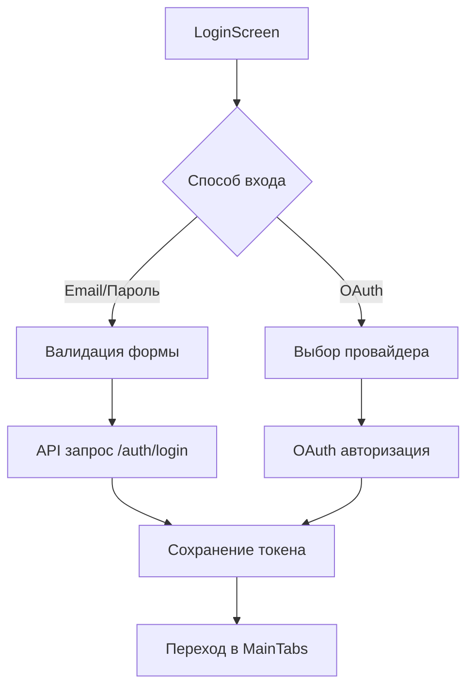
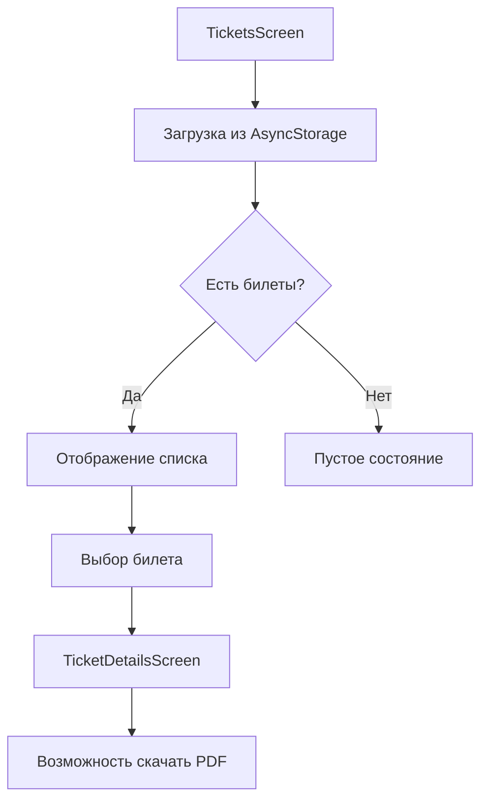

# Архитектура Frontend (React Native + Expo)

## Обзор

Мобильное приложение **Aviatickets** построено на React Native с использованием Expo SDK 54. Приложение предоставляет полный цикл бронирования авиабилетов: от поиска рейсов до получения электронного билета.

## Полная структура проекта

```
aviatickets-demo/
├── .expo/                           # Expo конфигурация приложения
│   ├── devices.json                 # Настройки устройств для разработки
│   ├── README.md                    # Документация Expo
│   └── settings.json                # Настройки проекта
├── assets/                          # Ресурсы приложения
│   ├── icons/                       # Иконки табов навигации
│   │   ├── tab-home.png            # Иконка вкладки "Главная"
│   │   ├── tab-profile.png         # Иконка вкладки "Профиль"
│   │   └── tab-tickets.png         # Иконка вкладки "Билеты"
│   ├── adaptive-icon.png           # Адаптивная иконка приложения
│   ├── avatar-placeholder.jpg      # Заглушка аватара пользователя
│   ├── avatar-placeholder.png      # Заглушка аватара (PNG)
│   ├── favicon.png                 # Фавикон для веб-версии
│   ├── home-wave.png              # Декоративные элементы
│   ├── icon.png                   # Основная иконка приложения
│   ├── plane.png                  # Иконка самолета для UI
│   └── splash-icon.png            # Иконка для splash screen
├── components/                      # Переиспользуемые UI компоненты
│   ├── FlightCard.js              # Карточка рейса в стиле билета
│   ├── Input.js                   # Поле ввода с лейблом
│   ├── LoadingOverlay.js          # Полноэкранный индикатор загрузки
│   └── PrimaryButton.js           # Основная кнопка приложения
├── constants/                       # Константы приложения
│   ├── airports.js                # Данные аэропортов для поиска
│   └── api.js                     # Конфигурация API endpoints
├── contexts/                        # React Context провайдеры
│   └── AuthContext.js             # Глобальное состояние аутентификации
├── data/                           # Статические данные
│   └── airports.js                # База данных аэропортов
├── hooks/                          # Кастомные React хуки
│   └── useFonts.js                # Хук для загрузки шрифтов
├── lib/                            # Библиотеки и утилиты
│   ├── api.js                     # HTTP клиент с JWT поддержкой
│   └── mockOrders.js              # Моковые данные заказов
├── navigation/                      # Навигация приложения
│   ├── BottomTabs.js              # Нижние табы (Home, Tickets, Profile)
│   └── RootNavigation.js          # Корневая навигация (Stack Navigator)
├── screens/                         # Экраны приложения
│   ├── AccountScreen.js           # Настройки аккаунта
│   ├── BookingScreen.js           # Подтверждение бронирования
│   ├── FaqScreen.js               # Часто задаваемые вопросы
│   ├── FlightDetailsScreen.js     # Детали выбранного рейса
│   ├── HomeScreen.js              # Главный экран с поиском
│   ├── LoginScreen.js             # Авторизация (email + OAuth)
│   ├── LogoutScreen.js            # Экран выхода из системы
│   ├── PassengerInfoScreen.js     # Ввод данных пассажиров
│   ├── PaymentScreen.js           # Экран оплаты
│   ├── PaymentsScreen.js          # История платежей
│   ├── ProfileScreen.js           # Профиль пользователя
│   ├── ResultsScreen.js           # Результаты поиска рейсов
│   ├── SearchScreen.js            # Расширенный поиск
│   ├── SeatSelectionScreen.js     # Выбор мест в самолете
│   ├── SelectCityScreen.js        # Выбор города отправления/назначения
│   ├── SettingsScreen.js          # Настройки приложения
│   ├── SignUpScreen.js            # Регистрация нового пользователя
│   ├── SplashScreen.js            # Загрузочный экран
│   ├── SupportOptionsScreen.js    # Опции поддержки
│   ├── SupportScreen.js           # Чат с поддержкой
│   ├── TicketDetailsScreen.js     # Детали конкретного билета
│   └── TicketsScreen.js           # Список билетов пользователя
├── services/                        # Внешние сервисы
│   └── authProviders.js           # OAuth провайдеры (Google, Apple, etc.)
├── utils/                          # Утилитарные функции
│   └── clearLocalBookings.js      # Очистка локальных бронирований
├── .easignore                      # EAS Build игнорируемые файлы
├── .gitignore                      # Git игнорируемые файлы
├── App.js                          # Корневой компонент приложения
├── app.json                        # Конфигурация Expo приложения
├── code.json                       # Конфигурация кода
├── eas.json                        # EAS Build конфигурация
├── index.js                        # Точка входа приложения
├── package-lock.json               # Зависимости (lock файл)
└── package.json                    # Зависимости и скрипты
```

## Технологический стек

- **Framework**: React Native 0.81.5
- **Platform**: Expo SDK 54
- **Navigation**: React Navigation 7 (Stack + Bottom Tabs)
- **State Management**: React Context API
- **HTTP Client**: Fetch API с кастомной оберткой
- **Authentication**: JWT + OAuth (Google, Apple, Yandex, Mail.ru)
- **Storage**: AsyncStorage + Expo SecureStore
- **UI**: Custom components + Expo Vector Icons
- **Fonts**: Google Fonts (Roboto)

---

## Архитектура навигации

### Структура навигации

```
RootNavigator (Stack)
├── Login/SignUp (Auth screens)
├── MainTabs (Bottom Tab Navigator)
│   ├── Home (Главная)
│   ├── Tickets (Мои билеты)
│   └── Profile (Профиль)
├── Search Flow
│   ├── SelectCity
│   ├── Results
│   ├── FlightDetails
│   ├── PassengerInfo
│   ├── SeatSelection
│   ├── Booking
│   └── Payment
├── Profile Flow
│   ├── Account
│   ├── Settings
│   └── Payments
└── Support Flow
    ├── SupportOptions
    ├── Support
    └── Faq
```

### Навигационные переходы

#### 1. **Поиск и бронирование рейсов**
```
Home → SelectCity → Home → Results → FlightDetails → 
PassengerInfo → SeatSelection → Booking → Payment → Tickets
```

#### 2. **Авторизация**
```
Login ↔ SignUp → MainTabs
```

#### 3. **Профиль и настройки**
```
Profile → Account/Settings/Payments/Support
```

---

## Основные экраны и их функции

### 1. **HomeScreen** (`screens/HomeScreen.js`)
**Назначение**: Главный экран поиска рейсов

**Функции**:
- Форма поиска рейсов (откуда/куда/дата/пассажиры/класс)
- Переключение "в одну сторону" / "туда-обратно"
- Выбор тарифов (Стандартный, Субсидированный, ДФО и др.)
- Валидация данных перед поиском
- Интеграция с API поиска рейсов

**Ключевые компоненты**:
- Градиентный фон с SVG волнами
- Dropdown меню для выбора пассажиров/класса
- DateTimePicker для выбора дат
- Кнопка смены направления (swap)

**API интеграция**:
```javascript
POST /flights/search
{
  origin: "SVO",
  destination: "LED", 
  departureDate: "2024-01-15T00:00:00.000Z",
  passengers: 1,
  serviceClass: "Economic",
  tariff: "Standard",
  tripType: "oneway"
}
```

### 2. **ResultsScreen** (`screens/ResultsScreen.js`)
**Назначение**: Отображение результатов поиска рейсов

**Функции**:
- Список найденных рейсов в виде карточек
- Отображение маршрута и количества результатов
- Обработка пустых результатов
- Переход к деталям рейса

**UI особенности**:
- Волновой градиентный фон
- Карточки рейсов с эффектом билета (вырезы по бокам)
- Floating кнопка для отладки (показ JSON)

### 3. **FlightDetailsScreen** (`screens/FlightDetailsScreen.js`)
**Назначение**: Детальная информация о выбранном рейсе

**Функции**:
- Подробная информация о рейсе
- Выбор тарифа из доступных
- Переход к заполнению данных пассажиров

### 4. **BookingScreen** (`screens/BookingScreen.js`)
**Назначение**: Подтверждение бронирования

**Функции**:
- Отображение итоговой информации о рейсе
- Подтверждение деталей бронирования
- Создание заказа через API
- Переход к оплате

**API интеграция**:
```javascript
POST /booking/create
{
  flight: {...},
  passengers: [...],
  contactInfo: {...}
}
```

### 5. **TicketsScreen** (`screens/TicketsScreen.js`)
**Назначение**: Список забронированных билетов

**Функции**:
- Отображение истории бронирований
- Переход к деталям билета
- Загрузка данных из локального хранилища

### 6. **LoginScreen** (`screens/LoginScreen.js`)
**Назначение**: Авторизация пользователей

**Функции**:
- Вход по email/паролю
- OAuth авторизация (Google, Apple, Yandex, Mail.ru)
- Валидация форм
- Сохранение токенов

**OAuth провайдеры**:
- **Google**: через Google OAuth 2.0
- **Apple**: через Apple Sign In (только iOS)
- **Yandex**: через Yandex OAuth
- **Mail.ru**: через Mail.ru OAuth

---

## Управление состоянием

### AuthContext (`contexts/AuthContext.js`)

**Назначение**: Глобальное управление аутентификацией

**Состояние**:
```javascript
{
  user: User | null,           // Данные пользователя
  token: string | null,        // JWT токен
  loading: boolean,            // Состояние загрузки
}
```

**Методы**:
- `login(token, userData)` - Авторизация пользователя
- `register(registerDto)` - Регистрация нового пользователя
- `logout()` - Выход из системы
- `updateUser(newData)` - Обновление данных пользователя

**Хранение данных**:
- **Токены**: Expo SecureStore (fallback: AsyncStorage)
- **Данные пользователя**: AsyncStorage
- **Автоматическая проверка**: Валидация токена при запуске

### Локальное состояние экранов

Каждый экран управляет своим локальным состоянием через `useState`:
- Данные форм
- Состояния загрузки
- Временные данные
- UI состояния (dropdown, модальные окна)

---

## API интеграция

### HTTP клиент (`lib/api.js`)

**Функции**:
- Автоматическое добавление JWT токенов
- Обработка ошибок авторизации (401)
- Парсинг JSON/text ответов
- Централизованная обработка ошибок

**Использование**:
```javascript
import { api } from '../lib/api';

// GET запрос
const data = await api('/flights/search');

// POST запрос
const result = await api('/booking/create', {
  method: 'POST',
  body: JSON.stringify(payload)
});
```

### Основные API endpoints

#### Авторизация
- `POST /auth/login` - Вход по email/паролю
- `POST /auth/register` - Регистрация
- `POST /auth/google` - OAuth Google
- `POST /auth/apple` - OAuth Apple
- `GET /me` - Получение данных пользователя

#### Поиск рейсов
- `POST /flights/search` - Поиск рейсов
- `POST /flights/fare-info` - Детали тарифа

#### Бронирование
- `POST /booking/create` - Создание бронирования
- `GET /booking` - Список бронирований
- `GET /booking/:id/pdf` - PDF билет

---

## UI компоненты

### Переиспользуемые компоненты

#### 1. **FlightCard** (`components/FlightCard.js`)
**Назначение**: Карточка рейса в результатах поиска

**Особенности**:
- Дизайн в стиле авиабилета с вырезами
- Отображение маршрута, времени, цены
- Информация о пересадках и доступных местах
- Кнопка бронирования

#### 2. **Input** (`components/Input.js`)
**Назначение**: Поле ввода с лейблом

#### 3. **PrimaryButton** (`components/PrimaryButton.js`)
**Назначение**: Основная кнопка приложения

#### 4. **LoadingOverlay** (`components/LoadingOverlay.js`)
**Назначение**: Индикатор загрузки на весь экран

### UI/UX особенности

#### Дизайн-система
- **Основной цвет**: #0277bd (синий)
- **Акцентный цвет**: #29A9E0 (голубой)
- **Шрифт**: Roboto (Regular, Medium, Bold)
- **Радиус скругления**: 12-20px
- **Тени**: Мягкие тени с низкой прозрачностью

#### Анимации и эффекты
- Градиентные фоны с SVG волнами
- Плавные переходы между экранами
- Эффекты нажатия на кнопки
- Dropdown анимации

---

## Пользовательские сценарии

### 1. Поиск и бронирование рейса

```mermaid
graph TD
    A[Открытие приложения] --> B[HomeScreen]
    B --> C[Заполнение формы поиска]
    C --> D[Выбор городов через SelectCity]
    D --> E[Нажатие "Поиск рейса"]
    E --> F[API запрос /flights/search]
    F --> G[ResultsScreen с результатами]
    G --> H[Выбор рейса]
    H --> I[FlightDetailsScreen]
    I --> J[Выбор тарифа]
    J --> K[PassengerInfoScreen]
    K --> L[Заполнение данных пассажиров]
    L --> M[SeatSelectionScreen - опционально]
    M --> N[BookingScreen]
    N --> O[Подтверждение бронирования]
    O --> P[API запрос /booking/create]
    P --> Q[PaymentScreen]
    Q --> R[Имитация оплаты]
    R --> S[TicketsScreen - билет готов]
```

### 2. Авторизация



### 3. Просмотр билетов



---

## Обработка ошибок

### Типы ошибок

1. **Сетевые ошибки**
   - Отсутствие интернета
   - Таймауты запросов
   - Ошибки сервера (5xx)

2. **Ошибки авторизации**
   - Неверные учетные данные
   - Истекший токен
   - Отсутствие прав доступа

3. **Ошибки валидации**
   - Некорректные данные форм
   - Отсутствие обязательных полей

4. **Бизнес-логика**
   - Нет доступных рейсов
   - Ошибки бронирования
   - Проблемы с оплатой

### Стратегии обработки

```javascript
// Автоматическая очистка токена при 401
if (res.status === 401) {
  await AsyncStorage.removeItem('authToken');
  await AsyncStorage.removeItem('user');
  throw new Error('Unauthorized');
}

// Показ пользовательских сообщений
Alert.alert('Ошибка', error.message || 'Что-то пошло не так');

// Fallback данные при ошибках API
const fallbackResults = this.getFallbackFlights();
```

---

## Производительность и оптимизация

### Оптимизации

1. **Ленивая загрузка**
   - Экраны загружаются по требованию
   - Изображения загружаются асинхронно

2. **Мемоизация**
   - `useMemo` для тяжелых вычислений
   - `useCallback` для функций

3. **Кеширование**
   - Результаты поиска в памяти
   - Данные пользователя в AsyncStorage

4. **Предзагрузка ресурсов**
   - Иконки загружаются заранее
   - Шрифты кешируются

### Метрики производительности

- **Время запуска**: ~2 секунды (включая splash screen)
- **Время поиска**: 3-5 секунд (зависит от API)
- **Размер приложения**: ~50MB (с ассетами)

---

## Безопасность

### Защита данных

1. **Токены**
   - Хранение в Expo SecureStore
   - Автоматическое удаление при 401
   - Короткий срок жизни (7 дней)

2. **Персональные данные**
   - Минимальное хранение на устройстве
   - Шифрование чувствительных данных

3. **API запросы**
   - HTTPS для всех запросов
   - Валидация на клиенте и сервере

### OAuth безопасность

- Использование официальных SDK
- Проверка redirect URI
- Валидация токенов на сервере

---

## Тестирование

### Типы тестов

1. **Unit тесты**
   - Утилитарные функции
   - API клиент
   - Валидация форм

2. **Integration тесты**
   - Навигация между экранами
   - API интеграция
   - AuthContext

3. **E2E тесты**
   - Полный цикл бронирования
   - Авторизация
   - Основные пользовательские сценарии

### Инструменты

- **Jest**: Unit тестирование
- **React Native Testing Library**: Тестирование компонентов
- **Detox**: E2E тестирование (планируется)

---

## Развертывание

### Expo Build Service (EAS)

```json
// eas.json
{
  "build": {
    "development": {
      "developmentClient": true,
      "distribution": "internal"
    },
    "preview": {
      "distribution": "internal"
    },
    "production": {
      "distribution": "store"
    }
  }
}
```

### Конфигурация окружений

```javascript
// constants/api.js
const getApiBase = () => {
  if (process.env.EXPO_PUBLIC_API_BASE) {
    return process.env.EXPO_PUBLIC_API_BASE;
  }
  return 'http://193.233.103.8:3000/api'; // Production
};
```

### Процесс релиза

1. **Development**: Expo Go для разработки
2. **Preview**: Internal distribution для тестирования
3. **Production**: App Store / Google Play

---

## Мониторинг и аналитика

### Логирование

```javascript
// Логирование ошибок
console.error('API Error:', error);

// Логирование пользовательских действий
console.log('User searched flights:', searchParams);
```

### Crash Reporting

- **Sentry**: Отслеживание ошибок (планируется)
- **Expo Analytics**: Базовая аналитика

---

## Планы развития

### Краткосрочные (1-2 месяца)

1. **Push уведомления**
   - Статус бронирования
   - Напоминания о рейсах

2. **Офлайн режим**
   - Кеширование билетов
   - Базовая функциональность без интернета

3. **Улучшение UX**
   - Анимации переходов
   - Скелетон загрузки

### Среднесрочные (3-6 месяцев)

1. **Дополнительные функции**
   - Выбор мест в самолете
   - Дополнительные услуги
   - Программа лояльности

2. **Платежи**
   - Интеграция с реальными платежными системами
   - Apple Pay / Google Pay

3. **Персонализация**
   - История поисков
   - Рекомендации направлений

### Долгосрочные (6+ месяцев)

1. **Расширение функций**
   - Бронирование отелей
   - Аренда автомобилей
   - Страхование

2. **Социальные функции**
   - Совместные поездки
   - Отзывы и рейтинги

3. **AI/ML**
   - Умные рекомендации
   - Предсказание цен

---

## Заключение

Архитектура фронтенда Aviatickets построена на современных принципах React Native разработки с акцентом на производительность, безопасность и пользовательский опыт. Модульная структура и четкое разделение ответственности обеспечивают легкость поддержки и масштабирования приложения.

Ключевые преимущества архитектуры:
- **Простота навигации**: Интуитивная структура экранов
- **Надежность**: Обработка ошибок и fallback сценарии
- **Безопасность**: Защищенное хранение токенов и данных
- **Производительность**: Оптимизированная загрузка и рендеринг
- **Масштабируемость**: Готовность к добавлению новых функций