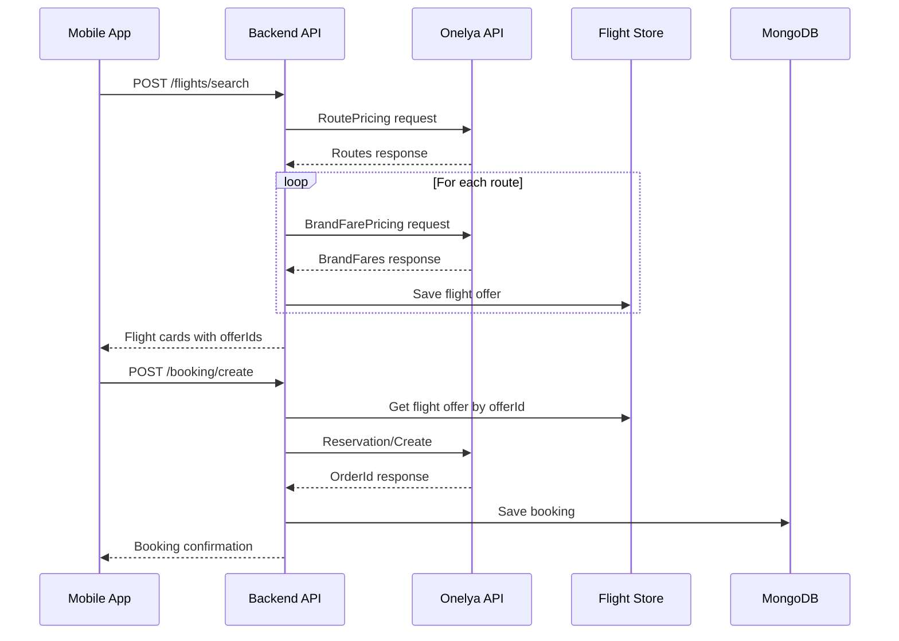

# АРХИТЕКТУРА ПРОЕКТА AVIATICKETS MARKET

## 📋 ОБЗОР ПРОЕКТА

**Aviatickets Market** - это полнофункциональная система для поиска и бронирования авиабилетов, состоящая из мобильного приложения на React Native и backend API на NestJS с интеграцией к внешнему провайдеру авиабилетов Onelya.

### 🎯 Основные возможности:
- Поиск авиарейсов по различным критериям
- Бронирование билетов с выбором тарифов
- Система авторизации (email/password + OAuth Google/Apple)
- Управление профилем пользователя
- Чат поддержки
- FAQ система
- Генерация PDF билетов

---

## 🏗️ АРХИТЕКТУРА СИСТЕМЫ

```
┌─────────────────────────────────────────────────────────────┐
│                    МОБИЛЬНОЕ ПРИЛОЖЕНИЕ                      │
│                    (React Native + Expo)                    │
│  ┌─────────────────┐  ┌─────────────────┐  ┌──────────────┐ │
│  │   Поиск рейсов  │  │   Бронирование  │  │   Профиль    │ │
│  └─────────────────┘  └─────────────────┘  └──────────────┘ │
└─────────────────────────────────────────────────────────────┘
                                │
                           HTTP/REST API
                                │
┌─────────────────────────────────────────────────────────────┐
│                      BACKEND API                            │
│                    (NestJS + TypeScript)                    │
│  ┌─────────────────┐  ┌─────────────────┐  ┌──────────────┐ │
│  │   Auth Module   │  │  Flights Module │  │ Booking Mod. │ │
│  │   Users Module  │  │  Onelya Module  │  │ Support Mod. │ │
│  └─────────────────┘  └─────────────────┘  └──────────────┘ │
└─────────────────────────────────────────────────────────────┘
                                │
                        HTTP API Integration
                                │
┌─────────────────────────────────────────────────────────────┐
│                    ВНЕШНИЕ СЕРВИСЫ                          │
│  ┌─────────────────┐  ┌─────────────────┐  ┌──────────────┐ │
│  │   Onelya API    │  │   MongoDB       │  │ Google OAuth │ │
│  │ (Авиабилеты)    │  │   (База данных) │  │   (Auth)     │ │
│  └─────────────────┘  └─────────────────┘  └──────────────┘ │
└─────────────────────────────────────────────────────────────┘
```

---

## 📱 МОБИЛЬНОЕ ПРИЛОЖЕНИЕ (React Native)

### 📂 Структура проекта:
```
aviatickets-demo/
├── components/          # Переиспользуемые компоненты
│   ├── FlightCard.js   # Карточка рейса
│   ├── FlightDetails.js # Детали рейса
│   ├── Input.js        # Поле ввода
│   ├── LoadingOverlay.js # Индикатор загрузки
│   └── PrimaryButton.js # Основная кнопка
├── constants/          # Константы и конфигурация
│   ├── airports.js     # Список аэропортов
│   └── ├── .expo/                                    # Expo конфигурация и кеш
│   ├── web/cache/production/images/favicon/
│   ├── devices.json
│   ├── README.md
│   └── settings.json
├── assets/                                   # Статические ресурсы
│   ├── icons/                               # Иконки навигации
│   │   ├── tab-home.png
│   │   ├── tab-profile.png
│   │   └── tab-tickets.png
│   ├── adaptive-icon.png
│   ├── avatar-placeholder.jpg
│   ├── avatar-placeholder.png
│   ├── favicon.png
│   ├── home-wave.png
│   ├── icon.png
│   ├── plane.png
│   └── splash-icon.png
├── components/                               # Переиспользуемые компоненты
│   ├── CityPickerSheet.js                   # Выбор города (новый)
│   ├── DateWheelSheet.js                    # Выбор даты (новый)
│   ├── FlightCard.js                        # Карточка рейса
│   ├── FlightDetails.js                     # Детали рейса
│   ├── Input.js                             # Поле ввода
│   ├── LoadingOverlay.js                    # Оверлей загрузки
│   └── PrimaryButton.js                     # Основная кнопка
├── constants/                               # Константы и конфигурация
│   ├── airports.js                          # Список аэропортов
│   └── api.js                              # Конфигурация API
├── contexts/                                # React Context
│   └── AuthContext.js                       # Контекст авторизации
├── data/                                    # Статические данные
│   ├── airports.js                          # База аэропортов
│   └── cities.js                           # База городов (новый)
├── hooks/                                   # Кастомные хуки
│   └── useFonts.js                          # Загрузка шрифтов
├── lib/                                     # Утилиты и API клиент
│   ├── api.js                              # HTTP клиент
│   └── mockOrders.js                        # Моковые данные
├── navigation/                              # Навигация приложения
│   ├── BottomTabs.js                        # Нижние вкладки
│   └── RootNavigation.js                    # Корневая навигация
├── screens/                                 # Экраны приложения (24 экрана)
│   ├── AccountScreen.js                     # Настройки аккаунта
│   ├── BookingScreen.js                     # Бронирование
│   ├── FaqScreen.js                         # FAQ
│   ├── FlightDetailsScreen.js               # Детали рейса
│   ├── HomeScreen.js                        # Главный экран поиска
│   ├── LoginScreen.js                       # Авторизация
│   ├── LogoutScreen.js                      # Выход
│   ├── NotificationsScreen.js               # Уведомления (новый)
│   ├── PassengerInfoScreen.js               # Данные пассажиров
│   ├── PaymentScreen.js                     # Оплата
│   ├── PaymentsScreen.js                    # История платежей
│   ├── ProfileScreen.js                     # Профиль
│   ├── ResultsScreen.js                     # Результаты поиска
│   ├── SearchScreen.js                      # Поиск
│   ├── SeatSelectionScreen.js               # Выбор мест
│   ├── SelectCityScreen.js                  # Выбор города
│   ├── SettingsScreen.js                    # Настройки
│   ├── SignUpScreen.js                      # Регистрация
│   ├── SplashScreen.js                      # Загрузочный экран
│   ├── SupportOptionsScreen.js              # Варианты поддержки
│   ├── SupportScreen.js                     # Чат поддержки
│   ├── TicketDetailsScreen.js               # Детали билета
│   └── TicketsScreen.js                     # Мои билеты
├── services/                                # Сервисы
│   └── authProviders.js                     # OAuth провайдеры
├── utils/                                   # Утилиты
│   ├── clearLocalBookings.js                # Очистка данных
│   └── normalizeFlight.ts                   # Нормализация рейсов (новый)
├── .easignore                               # EAS Build игнор
├── .gitignore                               # Git игнор
├── App.js                                   # Корневой компонент
├── app.json                                 # Конфигурация Expo
├── code.json                                # Дополнительная конфигурация
├── config.js                                # Конфигурационный файл (новый)
├── eas.json                                 # EAS Build конфигурация
├── index.js                                 # Точка входа
├── package-lock.json                        # Зафиксированные зависимости
├── package.json                             # Зависимости и скрипты
└── tsconfig.json                            # TypeScript конфигурация (новый)
```

### 🔧 Технологический стек:
- **React Native 0.81.5** - основной фреймворк
- **Expo SDK 54** - инструменты разработки  
- **React Navigation 7** - навигация между экранами
- **AsyncStorage** - локальное хранение данных
- **Expo SecureStore** - безопасное хранение токенов
- **React Native SVG** - векторная графика
- **Expo Image Picker** - работа с изображениями
- **TypeScript** - частичная поддержка (готовность к миграции)
- **Expo Font** - загрузка кастомных шрифтов Roboto
- **Expo Web Browser** - OAuth авторизация

### 🎨 Ключевые особенности UI/UX:
- **Современный Material Design** с градиентами
- **Адаптивная верстка** под разные размеры экранов
- **Анимации и переходы** для плавного UX
- **Темная/светлая тема** (частично реализовано)
- **Оффлайн поддержка** для базовых функций

### 📱 Основные экраны:

#### 🏠 HomeScreen (Главный экран)
- Форма поиска рейсов с полями:
  - Откуда/Куда (выбор городов)
  - Дата вылета/возврата
  - Количество пассажиров
  - Класс обслуживания
  - Тип тарифа
- Переключатель "В одну сторону"/"Туда-обратно"
- Кнопка поиска с валидацией

#### 🔍 ResultsScreen (Результаты поиска)
- Список найденных рейсов
- Фильтры по цене, времени, авиакомпании
- Сортировка по различным критериям
- Детальная информация о каждом рейсе

#### ✈️ BookingScreen (Бронирование)
- Форма данных пассажиров
- Выбор дополнительных услуг
- Расчет итоговой стоимости
- Интеграция с платежной системой

#### 👤 ProfileScreen (Профиль)
- Информация о пользователе
- История бронирований
- Настройки уведомлений
- Выход из аккаунта

---

## 🖥️ BACKEND API (NestJS)

### 📂 Структура проекта:
```
tickets-backend/
├── .expo/                                   # Expo конфигурация (не используется)
│   ├── README.md
│   └── settings.json
├── scripts/                                 # Скрипты развертывания
├── src/                                     # Исходный код
│   ├── assets/                             # Статические ресурсы
│   │   ├── fonts/
│   │   │   └── NotoSans-Regular.ttf
│   │   └── fonts 2/
│   ├── assets_temp/                        # Временные ресурсы
│   │   └── fonts/
│   │       └── NotoSans-Regular.ttf
│   ├── auth/                               # Модуль авторизации
│   │   ├── dto/                           # DTO для валидации
│   │   │   ├── login.dto.ts
│   │   │   ├── oauth.dto.ts
│   │   │   └── register.dto.ts
│   │   ├── guards/                        # Защитники маршрутов
│   │   │   └── jwt-auth.guard.ts
│   │   ├── auth.controller.ts             # Контроллер авторизации
│   │   ├── auth.module.ts                 # Модуль авторизации
│   │   ├── auth.service.ts                # Сервис авторизации
│   │   ├── oauth.controller.ts            # OAuth контроллер
│   │   └── oauth.service.ts               # OAuth сервис
│   ├── booking/                           # Модуль бронирования
│   │   ├── booking.controller.ts
│   │   ├── booking.module.ts
│   │   └── booking.service.ts
│   ├── faq/                               # Модуль FAQ
│   │   ├── faq-seed.service.ts
│   │   ├── faq.controller.ts
│   │   ├── faq.module.ts
│   │   ├── faq.service.ts
│   │   └── seed-faq.ts
│   ├── flights/                           # Модуль поиска рейсов
│   │   ├── direct-search.controller.ts    # Прямой поиск
│   │   ├── flight-offer.entity.ts         # Сущность предложения
│   │   ├── flight-offer.store.ts          # In-memory хранилище
│   │   ├── flights.controller.ts          # Контроллер рейсов
│   │   ├── flights.module.ts              # Модуль рейсов
│   │   └── flights.service.ts             # Сервис рейсов
│   ├── onelya/                            # Интеграция с Onelya API
│   │   ├── dto/                          # DTO для Onelya API
│   │   │   ├── avia-search.dto.ts
│   │   │   └── order-reservation.dto.ts
│   │   ├── interceptors/                 # Перехватчики запросов
│   │   │   └── onelya-logging.interceptor.ts
│   │   ├── utils/                        # Утилиты
│   │   │   ├── provider-raw.builder.ts
│   │   │   └── select-brand-fare.ts
│   │   ├── onelya.controller.ts
│   │   ├── onelya.health.controller.ts   # Health check
│   │   ├── onelya.module.ts
│   │   └── onelya.service.ts
│   ├── providers/                         # Абстракция провайдеров
│   │   ├── onelya.provider.ts
│   │   └── provider.interface.ts
│   ├── schemas/                           # MongoDB схемы
│   │   ├── booking.schema.ts             # Схема бронирования
│   │   ├── faq.schema.ts                 # Схема FAQ
│   │   ├── support-message.schema.ts     # Схема сообщений поддержки
│   │   └── user.schema.ts                # Схема пользователя
│   ├── support/                          # Модуль поддержки
│   │   ├── support.controller.ts
│   │   ├── support.module.ts
│   │   └── support.service.ts
│   ├── users/                            # Модуль пользователей
│   │   ├── dto/
│   │   │   └── update-user.dto.ts
│   │   ├── users.controller.ts
│   │   ├── users.module.ts
│   │   └── users.service.ts
│   ├── app.controller.spec.ts            # Тесты контроллера
│   ├── app.controller.ts                 # Корневой контроллер
│   ├── app.module.ts                     # Корневой модуль
│   ├── app.service.ts                    # Корневой сервис
│   └── main.ts                           # Точка входа
├── test/                                  # E2E тесты
│   ├── app.e2e-spec.ts
│   └── jest-e2e.json
├── web: node dist/                        # Скомпилированный код
│   └── main.js
├── .dockerignore                          # Docker игнор
├── .env                                   # Переменные окружения
├── .eslintrc.js                          # ESLint конфигурация
├── .gitignore                            # Git игнор
├── .prettierrc                           # Prettier конфигурация
├── backend.log                           # Лог файл
├── backend.pid                           # PID файл
├── docker-compose.yml                    # Docker Compose
├── Dockerfile                            # Docker образ
├── ecosystem.config.js                   # PM2 конфигурация
├── nest-cli.json                         # NestJS CLI конфигурация
├── package-lock.json                     # Зафиксированные зависимости
├── package.json                          # Зависимости и скрипты
├── README.md                             # Документация
├── tsconfig.build.json                   # TypeScript сборка
└── tsconfig.json                         # TypeScript конфигурация
```

### 🔧 Технологический стек:
- **NestJS 10** - основной фреймворк
- **TypeScript 5.9** - типизированный JavaScript
- **MongoDB + Mongoose** - база данных
- **JWT + Passport** - авторизация
- **Swagger/OpenAPI** - документация API
- **Axios** - HTTP клиент для внешних API
- **bcrypt** - хеширование паролей
- **class-validator** - валидация DTO

### 🏛️ Архитектурные принципы:

#### 📦 Модульная архитектура
Каждый модуль инкапсулирует свою бизнес-логику:
- **AuthModule** - авторизация и аутентификация
- **FlightsModule** - поиск рейсов
- **BookingModule** - бронирование билетов
- **OnelyaModule** - интеграция с внешним API
- **UsersModule** - управление пользователями
- **SupportModule** - система поддержки
- **FaqModule** - база знаний

#### 🔒 Система безопасности
- **JWT токены** с истечением через 7 дней
- **bcrypt хеширование** паролей (10 раундов)
- **JwtAuthGuard** для защиты приватных маршрутов
- **OAuth интеграция** с Google и Apple
- **Валидация входных данных** через class-validator
- **CORS настройки** для безопасных запросов

#### 📊 База данных (MongoDB)
```javascript
// Схема пользователя
User {
  fullName: string
  email: string (unique, indexed)
  phone: string
  passwordHash: string (select: false)
  passport: {
    passportNumber?: string
    country?: string
    expiryDate?: Date
  }
  notifications: {
    emailNotifications: boolean
    pushNotifications: boolean
  }
  consents: {
    termsAccepted: boolean
    termsAcceptedAt?: Date
    notificationsAccepted: boolean
    notificationsAcceptedAt?: Date
  }
  avatarUrl?: string
  avatar?: Buffer (select: false)
  googleId?: string (indexed)
  appleId?: string (indexed)
  oauthProvider?: 'google' | 'apple'
  isActive: boolean
  createdAt: Date
  updatedAt: Date
}

// Схема бронирования
Booking {
  user: ObjectId (ref: User)
  from: string
  to: string
  departureDate: Date
  returnDate?: Date
  isRoundTrip: boolean
  flightNumber?: string
  passengers: Array<{
    fullName: string
    passportNumber?: string
    dateOfBirth?: Date
  }>
  payment: {
    paymentStatus: 'pending' | 'virtual' | 'paid' | 'canceled' | 'refunded'
    amount: number
    currency: string
    paymentMethod?: string
    cardLast4?: string
    cardBrand?: string
  }
  bookingStatus: 'created' | 'awaiting_payment' | 'paid' | 'ticketed' | 'canceled' | 'voided'
  provider?: string
  providerBookingId?: string
  rawProviderData?: any
  createdAt: Date
  updatedAt: Date
}
```

---

## 🔌 ИНТЕГРАЦИЯ С ONELYA API

### 🎯 Основные эндпоинты Onelya:

#### 🔍 Поиск рейсов
- **RoutePricing** - основной поиск маршрутов
- **BrandFarePricing** - получение брендированных тарифов
- **DatePricing** - поиск по датам
- **FareInfoByRoute** - детальная информация о тарифах

#### 📋 Бронирование
- **Reservation/Create** - создание бронирования
- **Reservation/Recalc** - пересчет стоимости
- **Reservation/Confirm** - подтверждение бронирования
- **Reservation/Blank** - получение PDF билета
- **Reservation/Void** - отмена бронирования

### 🔄 Процесс поиска и бронирования:



### 🏪 Flight Offer Store
In-memory хранилище для временного хранения предложений рейсов:
```typescript
interface FlightOffer {
  offerId: string;           // UUID для фронтенда
  providerRoute: any;        // Исходный маршрут от RoutePricing
  providerRaw: any;          // Данные для бронирования от BrandFarePricing
  brandFares?: any[] | null; // Брендированные тарифы
}
```

---

## 🌐 API ЭНДПОИНТЫ

### 🔐 Авторизация (`/auth`)
```
POST /auth/register     - Регистрация пользователя
POST /auth/login        - Вход в систему
POST /auth/google       - OAuth через Google
POST /auth/apple        - OAuth через Apple
```

### ✈️ Поиск рейсов (`/flights`)
```
GET  /flights/health    - Health check сервиса
GET  /flights/search    - Поиск рейсов (GET)
POST /flights/search    - Поиск рейсов (POST)
POST /flights/fare-info - Детальная информация о тарифе
```

### 📋 Бронирование (`/booking`)
```
POST /booking/create    - Создание бронирования
GET  /booking/my        - Мои бронирования
GET  /booking/:id       - Детали бронирования
POST /booking/:id/pdf   - Получение PDF билета
POST /booking/:id/cancel - Отмена бронирования
```

### 👤 Пользователи (`/users`)
```
GET  /users/profile     - Профиль пользователя
PUT  /users/profile     - Обновление профиля
POST /users/avatar      - Загрузка аватара
```

### 💬 Поддержка (`/support`)
```
GET  /support/messages  - Сообщения поддержки
POST /support/messages  - Отправка сообщения
PUT  /support/messages/:id/read - Отметить как прочитанное
```

### ❓ FAQ (`/faq`)
```
GET  /faq              - Список FAQ
GET  /faq/categories   - Категории FAQ
```

### 🔧 Onelya Health (`/onelya`)
```
GET  /onelya/health    - Проверка доступности Onelya API
```

---

## 🚀 РАЗВЕРТЫВАНИЕ И ИНФРАСТРУКТУРА

### 🐳 Docker конфигурация
```yaml
# docker-compose.yml
version: '3.8'
services:
  api:
    build: .
    ports:
      - "3000:3000"
    environment:
      - NODE_ENV=development
      - MONGO_URI=mongodb://mongo:27017/tickets
      - JWT_SECRET=changeme
    depends_on:
      - mongo
  mongo:
    image: mongo:6
    restart: always
    ports:
      - "27017:27017"
    volumes:
      - mongo-data:/data/db
```

### 🌍 Переменные окружения
```bash
# Backend (.env)
PORT=3000
NODE_ENV=production

# Onelya API
ONELYA_BASE_URL=https://api-test.onelya.ru
ONELYA_LOGIN=trevel_test
ONELYA_PASSWORD=5mPaN5KyB!27LN!
ONELYA_POS=trevel_test

# Database
MONGO_URI=mongodb+srv://...

# JWT
JWT_SECRET=a7f3e9c2b8d4f1a6e5c9b3d7f2a8e4c1b9d5f3a7e2c8b4d1f6a9e3c7b2d8f4a1

# OAuth
GOOGLE_CLIENT_ID=656373020226-...
GOOGLE_CLIENT_SECRET=GOCSPX-...
YANDEX_CLIENT_ID=1f3f4e20e0ed4fe39e26b761664c6240
YANDEX_CLIENT_SECRET=019b02c429fb7d1ebdf0a555c3114c32
MAILRU_CLIENT_ID=019b02c429fb7d14b0b89e0fee923497
MAILRU_CLIENT_SECRET=aade9e8377bf45e198b58a9adfa36787
```

### 📱 Мобильное приложение
```javascript
// config.js
export const API_URL = 'http://193.233.103.8:3000/api';

// app.json
{
  "expo": {
    "extra": {
      "apiBase": "http://193.233.103.8:3000/api",
      "EXPO_PUBLIC_GOOGLE_CLIENT_ID": "656373020226-...",
      "EXPO_PUBLIC_YANDEX_CLIENT_ID": "1f3f4e20e0ed4fe39e26b761664c6240",
      "EXPO_PUBLIC_MAILRU_CLIENT_ID": "019b02c429fb7d14b0b89e0fee923497"
    }
  }
}
```

### 🔧 PM2 конфигурация
```javascript
// ecosystem.config.js
module.exports = {
  apps: [{
    name: 'aviatickets-backend',
    script: 'dist/main.js',
    instances: 1,
    autorestart: true,
    watch: false,
    max_memory_restart: '1G',
    env: {
      NODE_ENV: 'production',
      PORT: 3000
    }
  }]
};
```

---

## 🔄 ЖИЗНЕННЫЙ ЦИКЛ БРОНИРОВАНИЯ

### 1️⃣ Поиск рейсов
```
Пользователь → HomeScreen → Заполнение формы → POST /flights/search → 
→ Onelya RoutePricing → Создание providerRaw → Flight Store → 
→ ResultsScreen с карточками рейсов
```

### 2️⃣ Выбор рейса
```
Клик на FlightCard → FlightDetails modal → Просмотр тарифов → 
→ Кнопка "Забронировать" → PassengerInfoScreen
```

### 3️⃣ Бронирование
```
Ввод данных пассажиров → BookingScreen → POST /booking/create → 
→ Получение offerId из Store → Onelya Reservation/Create → 
→ Сохранение в MongoDB → Подтверждение бронирования
```

### 4️⃣ Управление билетами
```
TicketsScreen → GET /booking → Список бронирований → 
→ TicketDetailsScreen → Просмотр деталей → PDF генерация
```

---

## 🛡️ БЕЗОПАСНОСТЬ И ПРОИЗВОДИТЕЛЬНОСТЬ

### 🔒 Меры безопасности:
- **Хеширование паролей** с bcrypt (10 раундов)
- **JWT токены** с истечением через 7 дней
- **Валидация всех входных данных** через class-validator
- **CORS политики** для безопасных запросов
- **SecureStore** для хранения токенов в мобильном приложении
- **OAuth интеграция** с Google, Yandex, Mail.ru
- **Логирование всех операций** для аудита

### ⚡ Оптимизация производительности:
- **In-memory кеширование** предложений рейсов (Flight Store)
- **Lazy loading** экранов в React Navigation
- **Мемоизация** компонентов и хуков
- **Сжатие HTTP ответов** в NestJS
- **Индексы MongoDB** для быстрых запросов
- **Connection pooling** для базы данных
- **Batch обработка** BrandFarePricing запросов

### 📊 Мониторинг:
- **Структурированное логирование** с временными метками
- **Health checks** для всех сервисов
- **PM2 мониторинг** процессов
- **Error tracking** и уведомления
- **Performance метрики** для API запросов

---

## 🔮 ПЛАНЫ РАЗВИТИЯ

### 📈 Краткосрочные цели:
- ✅ **TypeScript миграция** мобильного приложения
- ✅ **Push уведомления** о статусе бронирований
- ✅ **Офлайн режим** для базовых функций
- ✅ **Расширенные фильтры** поиска
- ✅ **Платежные системы** интеграция
- ✅ **Unit тесты** для критических компонентов

### 🚀 Долгосрочные цели:
- 🔄 **Микросервисная архитектура** разделение на сервисы
- 🏨 **Бронирование отелей** расширение функциональности
- 🚗 **Аренда автомобилей** дополнительные услуги
- 🤖 **AI-помощник** для планирования путешествий
- 📱 **Веб-версия** приложения
- 🌍 **Интернационализация** поддержка языков
- 📊 **Аналитика** и бизнес-метрики

---

## 📚 ДОКУМЕНТАЦИЯ И РЕСУРСЫ

### 📖 Проектная документация:
- **АРХИТЕКТУРА_ПРОЕКТА.md** - общая архитектура системы
- **АРХИТЕКТУРА_ФРОНТЕНДА.md** - детальная архитектура мобильного приложения
- **СТРУКТУРА_ФРОНТЕНДА.md** - структура файлов фронтенда
- **ДОКУМЕНТАЦИЯ ОНЭЛИЯ.pdf** - документация Onelya API
- **схема работы с API.png** - схема интеграции

### 📖 API Документация:
- **Swagger UI**: `http://localhost:3000/api` (автогенерируемая)
- **Onelya API**: Документация в PDF файле проекта

### 🛠️ Инструменты разработки:
- **Backend**: NestJS CLI, TypeScript, MongoDB Compass, Postman
- **Mobile**: Expo CLI, React Native Debugger, Flipper
- **Testing**: Jest, Supertest, Detox (планируется)
- **DevOps**: Docker, PM2, EAS Build

### 📋 Команды для запуска:

#### Backend:
```bash
# Установка зависимостей
npm install

# Разработка
npm run start:dev

# Сборка
npm run build

# Продакшн
npm run start:prod

# Docker
docker-compose up

# PM2
pm2 start ecosystem.config.js
```

#### Mobile:
```bash
# Установка зависимостей
npm install

# Разработка
expo start

# Запуск на устройстве
expo start --android
expo start --ios

# Сборка
eas build --platform android --profile production
eas build --platform ios --profile production

# Публикация обновлений
eas update --branch production
```

---

## 🎯 ЗАКЛЮЧЕНИЕ

Проект **Aviatickets Market** представляет собой современную, масштабируемую систему для поиска и бронирования авиабилетов. Архитектура построена на принципах:

- **Модульности** - каждый компонент имеет четкую ответственность
- **Масштабируемости** - легко добавлять новые функции и провайдеров
- **Безопасности** - защита данных пользователей на всех уровнях
- **Производительности** - оптимизация для быстрой работы
- **Удобства использования** - интуитивный интерфейс
- **Надежности** - обработка ошибок и fallback механизмы

Система готова к продакшн развертыванию и дальнейшему развитию функциональности. Текущая архитектура поддерживает:

- **24 экрана** мобильного приложения
- **7 основных модулей** backend API
- **Полную интеграцию** с Onelya API
- **OAuth авторизацию** через 3 провайдера
- **Современный UI/UX** с анимациями и градиентами
- **TypeScript готовность** для типобезопасности
- **Docker контейнеризацию** для легкого развертывания
- **PM2 процесс-менеджмент** для продакшн среды

Проект демонстрирует лучшие практики разработки современных мобильных приложений и backend API с использованием актуальных технологий и архитектурных паттернов.PI->>Onelya: Reservation/Create
    Onelya-->>API: OrderId response
    API->>DB: Save booking
    API-->>App: Booking confirmation
```

### 🏪 Flight Offer Store
In-memory хранилище для временного хранения предложений рейсов:
```typescript
interface FlightOffer {
  offerId: string;           // UUID для фронтенда
  providerRoute: any;        // Исходный маршрут от RoutePricing
  providerRaw: any;          // Данные для бронирования от BrandFarePricing
  brandFares?: any[] | null; // Брендированные тарифы
}
```

---

## 🌐 API ЭНДПОИНТЫ

### 🔐 Авторизация (`/auth`)
```
POST /auth/register     - Регистрация пользователя
POST /auth/login        - Вход в систему
POST /auth/google       - OAuth через Google
POST /auth/apple        - OAuth через Apple
```

### ✈️ Поиск рейсов (`/flights`)
```
POST /flights/search    - Поиск рейсов
POST /flights/fare-info - Детальная информация о тарифе
```

### 📋 Бронирование (`/booking`)
```
POST /booking/create    - Создание бронирования
GET  /booking/my        - Мои бронирования
GET  /booking/:id       - Детали бронирования
POST /booking/:id/pdf   - Получение PDF билета
POST /booking/:id/cancel - Отмена бронирования
```

### 👤 Пользователи (`/users`)
```
GET  /users/profile     - Профиль пользователя
PUT  /users/profile     - Обновление профиля
POST /users/avatar      - Загрузка аватара
```

### 💬 Поддержка (`/support`)
```
GET  /support/messages  - Сообщения поддержки
POST /support/messages  - Отправка сообщения
PUT  /support/messages/:id/read - Отметить как прочитанное
```

### ❓ FAQ (`/faq`)
```
GET  /faq              - Список FAQ
GET  /faq/categories   - Категории FAQ
```

---

## 🚀 РАЗВЕРТЫВАНИЕ И ИНФРАСТРУКТУРА

### 🐳 Docker конфигурация
```yaml
# docker-compose.yml
version: '3.8'
services:
  api:
    build: .
    ports:
      - "3000:3000"
    environment:
      - NODE_ENV=development
      - MONGO_URI=mongodb://mongo:27017/tickets
      - JWT_SECRET=changeme
    depends_on:
      - mongo
  mongo:
    image: mongo:6
    restart: always
    ports:
      - "27017:27017"
    volumes:
      - mongo-data:/data/db
```

### 🌍 Переменные окружения
```bash
# Backend (.env)
PORT=3000
NODE_ENV=production

# Onelya API
ONELYA_BASE_URL=https://api-test.onelya.ru
ONELYA_LOGIN=trevel_test
ONELYA_PASSWORD=5mPaN5KyB!27LN!
ONELYA_POS=trevel_test

# Database
MONGO_URI=mongodb+srv://...

# JWT
JWT_SECRET=a7f3e9c2b8d4f1a6e5c9b3d7f2a8e4c1b9d5f3a7e2c8b4d1f6a9e3c7b2d8f4a1

# OAuth
GOOGLE_CLIENT_ID=656373020226-...
GOOGLE_CLIENT_SECRET=GOCSPX-...
```

### 📱 Мобильное приложение
```javascript
// constants/api.js
export const API_BASE = process.env.EXPO_PUBLIC_API_BASE || 
                        'http://193.233.103.8:3000/api';
```

---

## 🔄 ЖИЗНЕННЫЙ ЦИКЛ БРОНИРОВАНИЯ

### 1️⃣ Поиск рейсов
```
Пользователь → Форма поиска → Backend API → Onelya RoutePricing → 
→ Onelya BrandFarePricing → Flight Store → Результаты поиска
```

### 2️⃣ Выбор рейса
```
Клик на рейс → Детали рейса → Выбор тарифа → 
→ Переход к бронированию
```

### 3️⃣ Бронирование
```
Форма пассажиров → Валидация данных → Backend API → 
→ Onelya Reservation/Create → Сохранение в MongoDB → 
→ Подтверждение бронирования
```

### 4️⃣ Оплата (будущая функциональность)
```
Выбор способа оплаты → Платежный шлюз → 
→ Onelya Reservation/Confirm → Выдача билета
```

---

## 🛡️ БЕЗОПАСНОСТЬ И ПРОИЗВОДИТЕЛЬНОСТЬ

### 🔒 Меры безопасности:
- **Хеширование паролей** с bcrypt
- **JWT токены** с коротким временем жизни
- **Валидация всех входных данных**
- **CORS политики**
- **Rate limiting** (планируется)
- **Логирование всех операций**

### ⚡ Оптимизация производительности:
- **In-memory кеширование** предложений рейсов
- **Пагинация** результатов поиска
- **Lazy loading** в мобильном приложении
- **Сжатие HTTP ответов**
- **Индексы MongoDB** для быстрых запросов
- **Connection pooling** для базы данных

### 📊 Мониторинг:
- **Логирование** всех API запросов
- **Health checks** для внешних сервисов
- **Метрики производительности**
- **Error tracking** и уведомления

---

## 🔮 ПЛАНЫ РАЗВИТИЯ

### 📈 Краткосрочные цели:
- ✅ Интеграция с реальными платежными системами
- ✅ Push уведомления
- ✅ Офлайн режим для базовых функций
- ✅ Расширенные фильтры поиска
- ✅ Система лояльности

### 🚀 Долгосрочные цели:
- 🔄 Интеграция с другими провайдерами авиабилетов
- 🏨 Добавление бронирования отелей
- 🚗 Аренда автомобилей
- 🤖 AI-помощник для планирования путешествий
- 📱 Веб-версия приложения

---

## 📚 ДОКУМЕНТАЦИЯ И РЕСУРСЫ

### 📖 API Документация:
- **Swagger UI**: `http://localhost:3000/api`
- **Onelya API**: Документация в PDF файле проекта

### 🛠️ Инструменты разработки:
- **Backend**: NestJS CLI, TypeScript, MongoDB Compass
- **Mobile**: Expo CLI, React Native Debugger
- **Testing**: Jest, Supertest
- **DevOps**: Docker, PM2

### 📋 Команды для запуска:

#### Backend:
```bash
npm install
npm run start:dev    # Разработка
npm run build        # Сборка
npm run start:prod   # Продакшн
docker-compose up    # Docker
```

#### Mobile:
```bash
npm install
expo start           # Разработка
expo build:android   # Сборка Android
expo build:ios       # Сборка iOS
```

---

## 🎯 ЗАКЛЮЧЕНИЕ

Проект **Aviatickets Market** представляет собой современную, масштабируемую систему для поиска и бронирования авиабилетов. Архитектура построена на принципах:

- **Модульности** - каждый компонент имеет четкую ответственность
- **Масштабируемости** - легко добавлять новые функции и провайдеров
- **Безопасности** - защита данных пользователей на всех уровнях
- **Производительности** - оптимизация для быстрой работы
- **Удобства использования** - интуитивный интерфейс

Система готова к продакшн развертыванию и дальнейшему развитию функциональности.